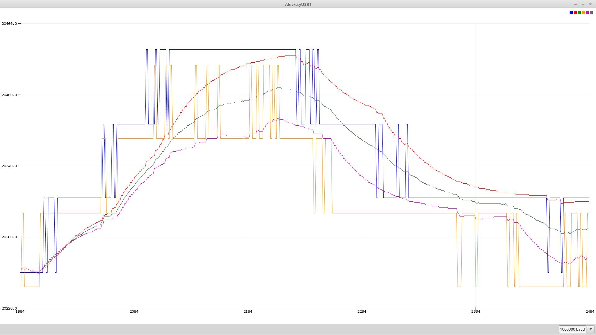
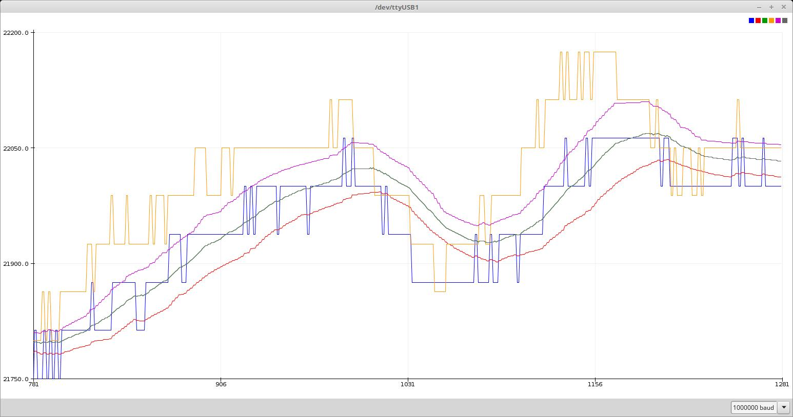

# DS18B20
<b>High resolution temperature measurement without any library and doing high speed multitasking in the background !</b>

#DEBUG enabled in Config.h: (Serial Monitor)

---------------

    Search devices ...
      FOUND: ROM = 10 94 91 2D 3 8 0 93   Chip = DS18S20  or older DS1820
      FOUND: ROM = 28 B5 45 E1 4 0 0 91   Chip = DS18B20
    2 devices found

    Dev:0  Conversion time(ms): 604  Job2-Count: 9816  Part0: 2455  Part1: 2455  Part2: 2455  Part3: 620  MaxWait: 252
      Data = 30 0 4B 46 FF FF B 10 83 
    CRC 83
    0  Temperature = 21.6125 21.6125 Celsius 
    Dev:1  Conversion time(ms): 600  Job2-Count: 19460  Part0: 4866  Part1: 4866  Part2: 4866  Part3: 597  MaxWait: 360
      Data = 81 1 4B 46 7F FF F 10 71 
    CRC 71
    1  Temperature = 21.6125 21.6125 Celsius 
    Dev:0  Conversion time(ms): 604  Job2-Count: 29170  Part0: 7293  Part1: 7293  Part2: 7293  Part3: 601  MaxWait: 360
      Data = 30 0 4B 46 FF FF B 10 83 
    CRC 83

---------------

Even the CRC-calculation is done without library. 
Multitasking: DoJob2() is called about 10.000 times per 0.6 seconds. 
DoJob2() is a simple state machine to demonstrate (cooperative) multitasking without any OS. 
Part3 is called every ms with sufficient precision to simulate an RTOS task. 

Advantage: Taskswitches are done at defined points - YOU decide where taskswitches are possible, not a timer. 

        Blue    1. Device raw
        RED     1. Device filtered
        Orange  2. Device raw
        Magenta 2. Device filtered
        Green   Average of 1. and 2. Device

 There are a lot of programs around to read temperatures from 1 wire DS1820, DS18B20, DS18S20 devices

 Why another one ?

 1. This program does NOT use any library !
    Libraries are good to get simple access to devices. But they hide what is going on behind the scene. And sometimes
    you want to understand what they are doing.
    Normally Wire- and Dallas-libraries are used.

 2. This program searches for connected one-wire slaves and uses all found DS18(B)20-devices.
    Perfect for measuring temperatures in different roms.
    It will run even if one device breaks !

 3. Normally temperatures are changing slowly compared to the speed of measurements.
    But you always get noise at least of +/- 1 bit.   
    This program shows a simple but efficient method to filter the measured values to get smooth curves and rise the overall resolution.

 3. Most libraries just work with fixed delays (depending on resolution) internaly.
    Here we call a state machine function [ DoJob2() ] while waiting for measurements to complete (about 600 ms for 12 bit resolution!)

    DoJob2() is called about 16000 times per second !
    It is devided in 4 parts - it is possible to call 4 Functions in a round robin fashion.
    It is garanteed, that the maximum delay from one call to another is less than 400 µs.

    Using this simple multitasking most of the CPU time may be used for other jobs than measuring temperatures.

 4. 

    Enjoy it.
    
    
    
    
    
